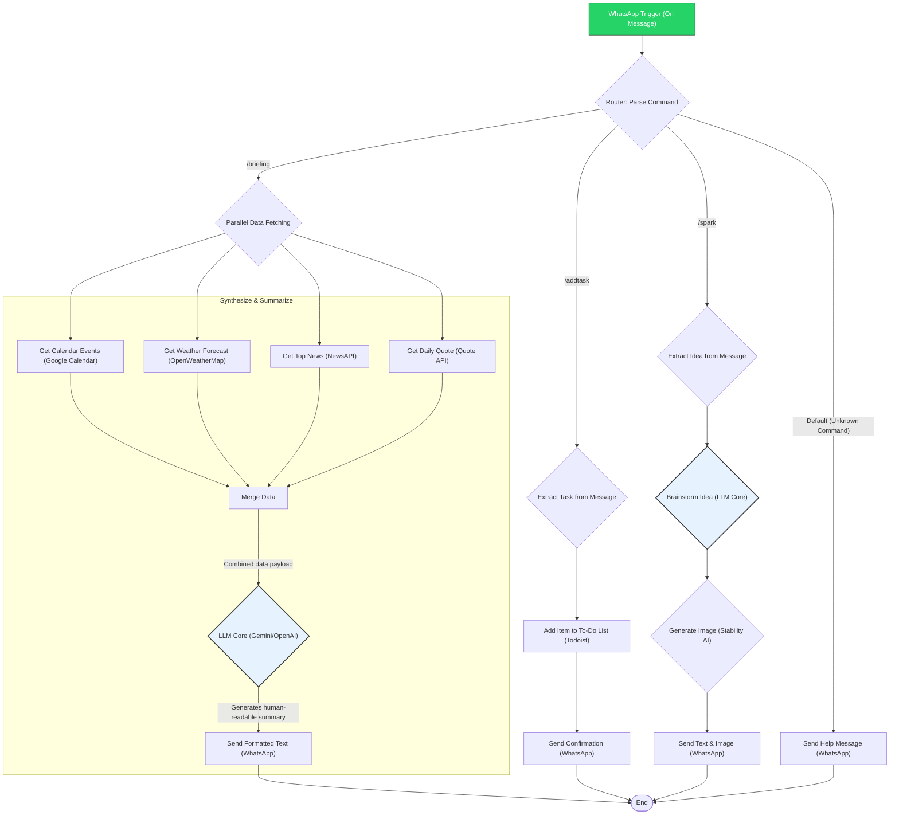

# Project Plan: "Concierge" - The n8n Personal Productivity Assistant

## 1. Vision & Executive Summary

**Project "Concierge"** is a showcase of a sophisticated, multi-purpose AI assistant built entirely within the **n8n** automation platform and accessed via **WhatsApp**. It acts as a personal productivity aide, demonstrating how n8n can seamlessly orchestrate a variety of APIs and AI models to deliver a rich, personalized, and interactive user experience.

The agent is designed to be more than a simple chatbot. It's a "co-pilot" for a user's day, capable of synthesizing information from multiple sources, taking action on their behalf, and even assisting in creative tasks. Its primary goal is to demonstrate the power of low-code automation platforms for creating complex and valuable AI agents.

## 2. Core Features & User Interactions

The agent will respond to specific commands sent via WhatsApp:

*   **/briefing**: Delivers a personalized "Daily Briefing" by fetching and summarizing:
    *   Today's calendar events from Google Calendar.
    *   The current weather forecast from OpenWeatherMap.
    *   The top 3 headlines from a preferred news source via NewsAPI.
    *   An inspirational quote to start the day.
    The final output is not just raw data, but a cohesive summary generated by a large language model (LLM).

*   **/addtask [Your task]**: Adds a task to a user's preferred to-do list application (e.g., Todoist, Google Tasks).
    *   *Example: `/addtask Buy groceries for the week`*

*   **/spark [Your idea]**: Acts as a creative co-pilot. It takes a concept and uses generative AI to:
    1.  Brainstorm a more detailed idea.
    2.  Generate a relevant image using a text-to-image model (e.g., Stability AI, DALL-E).
    *   *Example: `/spark A logo for a futuristic coffee shop`*

*   **/help**: Displays a list of available commands and their usage.

## 3. Agent Persona

**Concierge** is professional, efficient, and slightly witty. It communicates clearly and concisely, using Markdown for formatting (bolding, italics) to improve readability within WhatsApp. It aims to feel like a highly competent human assistant, not a robot.

## 4. n8n Workflow Architecture

The entire agent logic will be contained within a single n8n workflow. The architecture is designed to be modular and easy to understand, relying on n8n's core nodes.

### Mermaid Flowchart

This diagram illustrates the complete data flow, from receiving a WhatsApp message to sending a composed, intelligent response.



## 5. Key n8n Components

*   **Trigger:**
    *   **WhatsApp Trigger Node:** The entry point for the entire workflow, configured to listen for incoming messages.

*   **Logic:**
    *   **Router Node:** The main traffic controller. It inspects the incoming message text and directs the flow to the correct branch based on the command (`/briefing`, `/addtask`, etc.).

*   **API Modules (Data Fetching):**
    *   **Google Calendar Node:** Fetches events for the current day.
    *   **OpenWeatherMap Node:** Gets weather data for a predefined location.
    *   **HTTP Request Node (for News/Quotes):** A flexible node to connect to any REST API, such as NewsAPI.

*   **AI Core:**
    *   **Google Vertex AI / Gemini Node (or OpenAI Node):** This is the agent's "brain." It will be used for two purposes:
        1.  **Summarization:** Taking the JSON data from all the fetched sources and turning it into the "Daily Briefing" narrative.
        2.  **Idea Generation:** Brainstorming ideas for the `/spark` command.
    *   **Stability AI Node (or HTTP Request to DALL-E):** Generates images based on the text prompt from the `/spark` command.

*   **Action Modules:**
    *   **Todoist Node:** Adds new items to a specified project.
    *   **WhatsApp Sender Node:** Used in every branch to send the final text, image, or confirmation message back to the user.

## 6. AI Prompt Engineering (Example for /briefing)

The quality of the agent's output depends heavily on the system prompt provided to the LLM.

**System Prompt for the Daily Briefing:**

> You are "Concierge," a world-class personal assistant. Your tone is professional, efficient, and friendly. You will receive a JSON object containing data about my day. Your task is to synthesize this information into a concise, human-readable summary formatted for WhatsApp using Markdown (*bold*, _italic_, ~strikethrough~).
>
> **Rules:**
> 1.  Start with a pleasant greeting and address the current weather immediately.
> 2.  List all calendar events clearly with their times. If there are no events, state that the schedule is clear.
> 3.  Present the top news headlines as a simple, easy-to-scan list.
> 4.  End with the provided inspirational quote.
> 5.  Do not invent any information. If a piece of data (like news or calendar) is missing, state that you couldn't retrieve it.
>
> **Input Data:**
> ```json
> {{ $json.data }}
> ```
>
> **Example Output:**
>
> *Good morning!* ☀️
>
> It's currently *15°C and partly cloudy* outside. Looks like a pleasant day ahead!
>
> Here’s what’s on your schedule:
> • *10:00 AM - 11:00 AM:* Team Sync Meeting
> • *2:00 PM - 2:30 PM:* Project Phoenix Check-in
>
> Here are today's top headlines:
> 1.  _Global Tech Summit Kicks Off in Silicon Valley_
> 2.  _New Breakthrough in Renewable Energy Announced_
> 3.  _SpaceX Launches 50 More Starlink Satellites_
>
> And finally, your thought for the day:
> _"The only way to do great work is to love what you do."_

## 7. Implementation Plan

1.  **Prerequisites:**
    *   A running n8n instance (cloud or self-hosted).
    *   A Meta for Developers account with a configured WhatsApp Business App.
    *   API keys for Google (Calendar), OpenWeatherMap, NewsAPI, an LLM provider (Google/OpenAI), and an image provider (Stability AI).

2.  **n8n Setup:**
    *   Create all necessary credentials within the n8n credential store. This is crucial for security.

3.  **Workflow Construction:**
    *   Build the workflow visually, following the Mermaid diagram.
    *   Start with a single branch (e.g., `/help`) to test the core WhatsApp trigger/response loop.
    *   Implement the `/briefing` branch, ensuring all parallel API calls merge correctly.
    *   Implement and test the `/addtask` and `/spark` branches individually.

4.  **Testing:**
    *   Thoroughly test each command, including edge cases (e.g., no calendar events, failed API calls, unknown commands).
    *   Refine the LLM prompt to achieve the desired tone and format.
