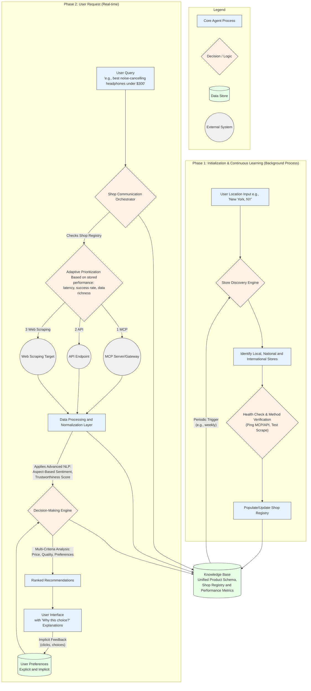

# AI Shopping Agent: Dynamic Planning Document (v2.0)

This document outlines the architecture for an advanced AI agent designed to explore online shops and identify the best products based on quality, price, and user preferences. The agent is built on a philosophy of continuous learning and adaptation, using a hybrid communication strategy to ensure maximum coverage and resilience.

## Agent Architecture and Philosophy

The agent's design is modular and built around two interconnected operational cycles: an **Initialization & Continuous Learning Phase** for building and maintaining its world knowledge, and a **User Request Phase** for fulfilling specific queries. The key philosophy is that the agent is not static; it actively maintains its knowledge base and adapts its strategies based on performance, making it more robust and intelligent over time.

### Revised Agent Operational Flow

## Key Components and Enhanced Functionality

### 1. Shop Communication Orchestrator
This is the agent's intelligent traffic controller. It consults the `Shop Registry` to determine how to contact each store.

*   **Adaptive Prioritization:** Instead of a fixed `MCP > API > Scraping` rule, the orchestrator makes a dynamic decision for each store based on performance metrics (latency, success rate, data richness) stored in the `Shop Registry`. If a store's MCP endpoint is slow but its API is fast and reliable, the agent will adaptively prioritize the API for that store.
*   **Performance Logging:** After each interaction, the orchestrator logs the performance, continuously refining its knowledge of the best way to communicate with each shop.

### 2. Store Discovery & Maintenance (Continuous Learning)
This is an ongoing background process, not just a one-time setup.

*   **Initial Discovery:** Upon first use, the agent takes a user's location and discovers relevant stores using business directory APIs (e.g., Google Places) and curated lists of prominent national/international retailers.
*   **Automated Health Checks:** The agent periodically runs "health checks" on all stores in its registry. It will ping API/MCP endpoints and run lightweight test scrapes to detect if a communication method is broken (e.g., a website redesign breaks a scraper, an API key is revoked).
*   **Self-Healing:** If a method fails a health check, the agent automatically updates the `Shop Registry`, downgrading the problematic method's priority and potentially flagging it for maintenance. This ensures the agent remains effective even as online stores change.
*   **Continuous Discovery:** On a schedule (e.g., weekly), the agent can re-run the discovery process to find new shops that have opened or become relevant.

### 3. MCP, API, and Web Scraping Modules
These modules handle the actual communication. Their core function remains the same, but they now report performance metrics back to the Orchestrator after each job.

*   **MCP Client Module:** Interacts with shops via the Model Context Protocol.
*   **API Client Module:** Manages communication with traditional RESTful or GraphQL APIs.
*   **Web Scraping Module:** The fallback method for legacy sites, containing shop-specific logic.

### 4. Data Processing & Normalization Layer
This layer is the heart of the agent's analytical intelligence. It ensures all data, regardless of source, is transformed into a consistent, high-quality format.

*   **Unified Schema:** Maps all incoming data to a standard internal schema (`product_id`, `name`, `price`, `currency`, `availability`, `url`, `quality_score`, etc.).
*   **Total Cost Calculation:** Normalizes price by attempting to factor in shipping and taxes to provide a more accurate total cost for comparison.
*   **Advanced Quality Score Generation:** This is a key AI feature.
    *   **Aspect-Based Sentiment Analysis (ABSA):** Instead of a single sentiment score from reviews, the NLP model extracts sentiment for key product features (e.g., for a phone: `battery_life: positive`, `camera: positive`, `screen: neutral`).
    *   **Review Trustworthiness:** A model assesses reviews to identify and down-weight potential spam or fake reviews, leading to a more reliable quality score.
    *   **Objective Spec Analysis:** The quality score also incorporates objective specifications (e.g., RAM for a computer, megapixels for a camera), weighted by their importance for that product category.

### 5. Knowledge Base (Database)
A central repository (e.g., a local SQLite or NoSQL database file) that stores the agent's long-term memory.

*   **Shop Registry:** A detailed table of known shops, their available communication methods (`MCP`, `API`, `Scraping`), endpoints, and crucially, their **performance metrics** (latency, success rate). This is continuously updated by the maintenance process.
*   **Unified Product Data:** Stores the normalized, cleaned product information (descriptions, specs, quality scores, reviews).
*   **Real-time Data Handling:** To ensure freshness, highly volatile data like **price and availability** are fetched in real-time during a user request. The results from these real-time checks are then used for the immediate recommendation.

### 6. Decision-Making & User Interface
This is the user-facing component that translates the agent's analysis into actionable recommendations.

*   **Personalized Ranking:** The decision-making engine uses a multi-criteria analysis model that incorporates:
    *   **Explicit Preferences:** The user can set their priorities, for example via sliders (`Price <-----> Quality`).
    *   **Implicit Preferences:** The agent can learn a user's preferences over time by observing their interactions (e.g., if a user consistently clicks on products from a certain brand).
*   **Explainable AI (XAI):** When presenting recommendations, the UI explains *why* a product was chosen. For example: *"This is the top choice because it has the best quality score for 'battery life', which you prioritized, and is within your budget."*
*   **Rich Interaction:** The UI provides tools for filtering, sorting, and side-by-side comparisons.

### 7. Ethics & Responsible Design
Even for a personal project, demonstrating responsible design is key.

*   **Respect for `robots.txt`:** The Web Scraping Module will programmatically check and adhere to each site's `robots.txt` file.
*   **Rate Limiting:** The agent will self-impose a respectful delay between requests to any single domain to avoid overwhelming the shop's server. This demonstrates "good bot" behavior.
*   **Transparency:** The agent's recommendations are transparent and explainable, avoiding a "black box" approach.
